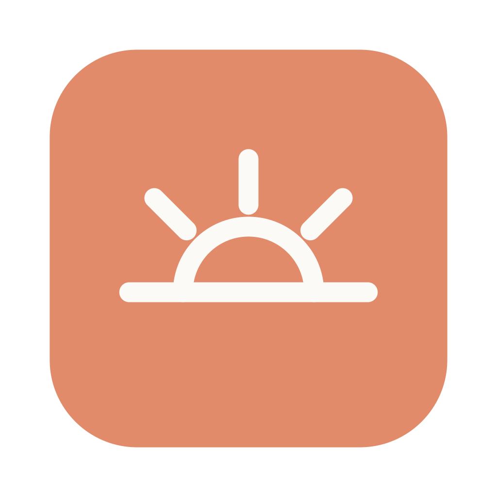
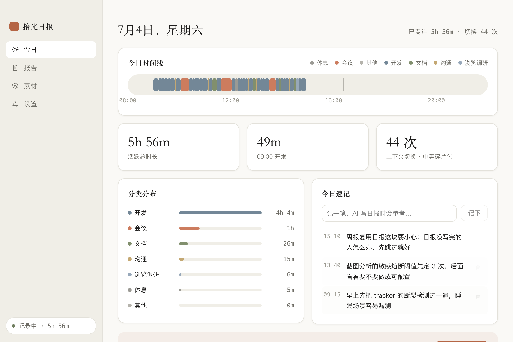
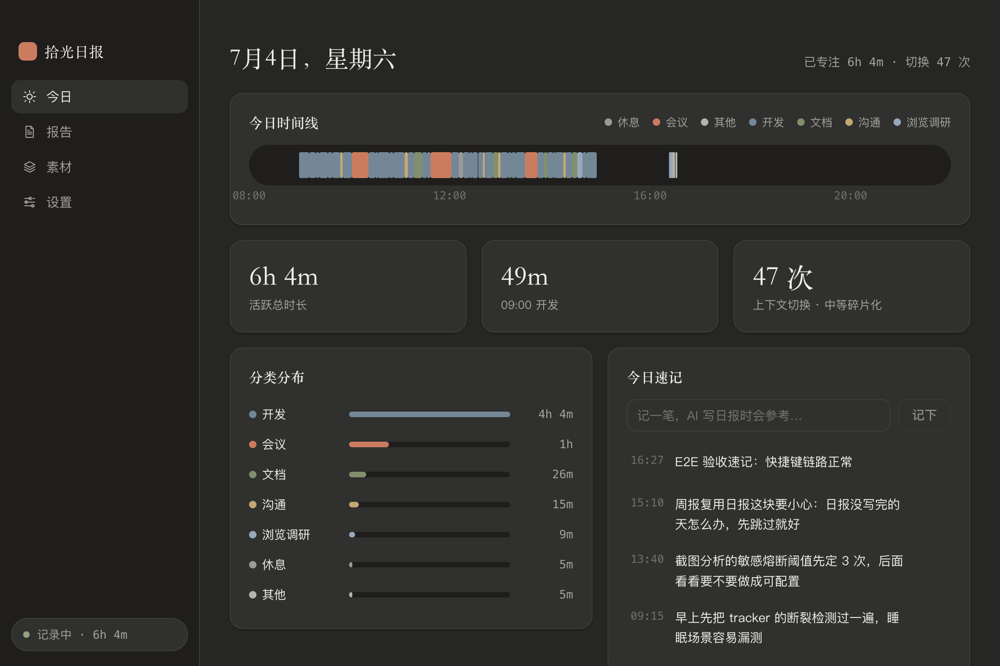
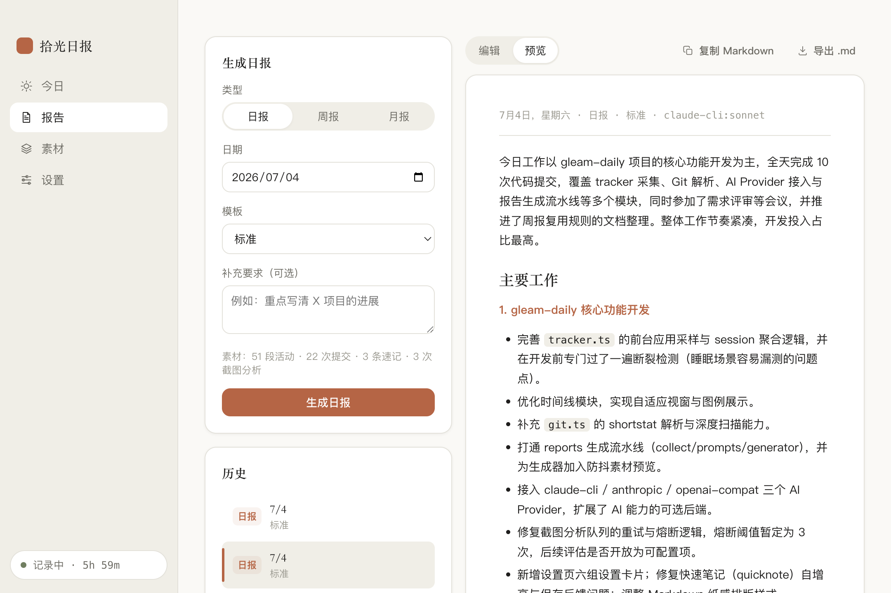
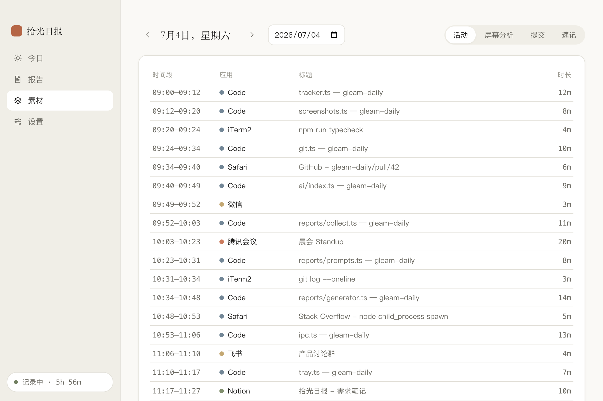
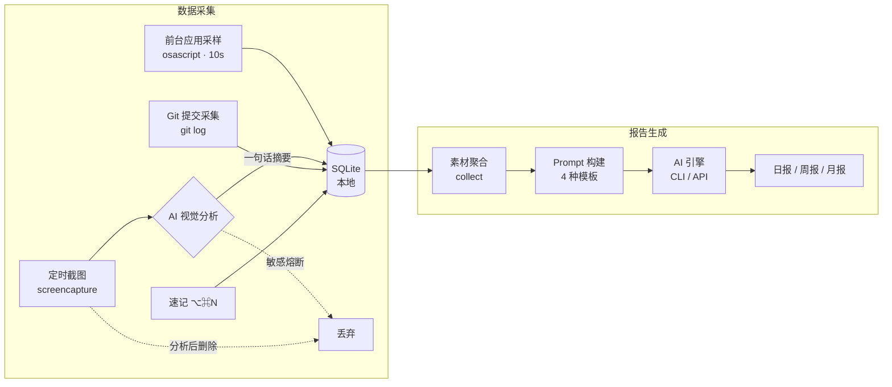

<div align="center">



# 拾光日报 · Gleam Daily

**你只管工作，日报交给 AI。**

100% 本地、隐私优先的 macOS 工作记录与智能日报助手

[-black?logo=apple)](#-快速开始)
[](LICENSE)
[](#-技术架构)
[](CONTRIBUTING.md)
[](#-隐私设计)

[功能特性](#-功能特性) · [截图](#-界面预览) · [快速开始](#-快速开始) · [AI 引擎](#-ai-引擎) · [隐私设计](#-隐私设计) · [技术架构](#-技术架构) · [参与开发](#-参与开发)

</div>

---

写日报是打工人每天最不想做、又不得不做的事。拾光日报在后台**安静地记录你的工作轨迹**——前台应用时间线、屏幕内容摘要、Git 提交、随手速记——下班前点一下，AI 把这一天整理成一份**忠于事实**的日报/周报/月报。

**所有数据都留在你的 Mac 上。** 没有账号，没有服务器，没有遥测。AI 请求要么走你本机已登录的 Claude Code / Codex CLI（零配置），要么用你自己的 API Key 直连服务商。

## ✨ 功能特性

- 🕐 **应用时间线** —— 每 10 秒采样前台应用与窗口标题，自动聚合为彩色时间线；智能分类（开发/会议/沟通/文档/设计/调研…），浏览器按页面内容细分
- 📸 **屏幕分析** —— 定期截图 → AI 提炼成一句话工作摘要 → **图片立即删除**；检测到密码/支付等敏感画面自动熔断跳过
- 🔀 **Git 提交汇入** —— 添加仓库或扫描目录，当天的 commit（含变更规模）自动成为日报素材
- ✍️ **全局速记** —— 任意界面 `⌥⌘N` 呼出速记小窗，你的主观补充在生成日报时享有最高优先级
- 🤖 **四种 AI 引擎** —— Claude Code CLI / Codex CLI（免 API Key）、Anthropic API、任意 OpenAI 兼容端点，一键切换
- 📝 **日报 / 周报 / 月报** —— 四种模板（标准/简洁/技术/OKR）+ 自定义补充要求；周报月报优先复用已生成的日报做层级汇总，更省 token、质量更高
- 📊 **专注洞察** —— 活跃时长、最长专注块、上下文切换次数与碎片化评语
- 🌗 **Claude 风格双主题** —— 米白纸感 / 暖炭深色，衬线标题，跟随系统自动切换
- 🔒 **本地优先** —— SQLite 本地存储，API Key 系统级加密，一键清除所有数据
- ⏸️ **懂分寸** —— 空闲自动暂停、排除应用列表（如密码管理器）不记录标题不截图

## 📸 界面预览

| 今日 · 浅色 | 今日 · 深色 |
|:---:|:---:|
|  |  |

| AI 生成日报 | 素材明细 |
|:---:|:---:|
|  |  |

## 🚀 快速开始

### 下载安装

从 [Releases](../../releases) 下载最新的 `.dmg`，拖进「应用程序」即可。

> 目前仅支持 Apple Silicon（arm64）。本地构建见[参与开发](#-参与开发)。

### 三步跑起来

1. **授权记录** —— 首次启动后切换一次前台应用，允许弹出的「自动化」权限，时间线开始记录
2. **选择 AI 引擎** —— 如果本机装有 [Claude Code](https://claude.com/claude-code) 或 [Codex CLI](https://github.com/openai/codex)，开箱即用、无需任何 API Key；否则在 设置 → AI 引擎 填入你的 Key
3. **生成日报** —— 下班前打开「报告」页（或点菜单栏 → 生成今日日报），30 秒拿到成稿，支持编辑、复制、导出 Markdown

可选：开启「屏幕分析」时会请求「屏幕录制」权限；在 设置 → Git 添加仓库让提交记录自动汇入。

## 🤖 AI 引擎

| 引擎 | API Key | 说明 |
|---|:---:|---|
| **Claude Code CLI** | 不需要 | 复用本机已登录的 `claude`，推荐 Claude 用户 |
| **Codex CLI** | 不需要 | 复用本机已登录的 `codex`（`--ignore-user-config` 隔离运行，不触发你的 hooks、不污染会话历史） |
| **Anthropic API** | 需要 | 自备 Key 直连，Key 经 `safeStorage` 系统级加密存储 |
| **OpenAI 兼容** | 需要 | 任意兼容 `/chat/completions` 的端点（含本地推理服务） |

文本生成与截图视觉分析走同一引擎；CLI 引擎的子进程固定在应用数据目录运行，不会吸入你其他项目的上下文。

## 🔒 隐私设计

这个项目存在的理由就是「不放心闭源的屏幕记录软件」，所以隐私是架构级承诺而不是设置项：

- **数据不出本机** —— 所有记录存于 `~/Library/Application Support/gleam-daily/` 的 SQLite，无服务器、无账号、无遥测
- **截图阅后即焚** —— 截图仅用于 AI 提炼一句话摘要，分析完成立即删除原图（可审计：`src/main/screenshots.ts`）
- **敏感熔断** —— AI 判定画面含密码框、支付、证件等内容时，丢弃全部分析结果只留一条 `skipped` 标记
- **排除名单** —— 名单内应用在前台时不记录窗口标题、不参与截图
- **Key 不进渲染层** —— API Key 用 macOS 钥匙串加密（Electron `safeStorage`），解密只发生在主进程，UI 只能看到掩码
- **AI 直连** —— 请求从你的机器直达服务商（或本机 CLI），没有任何中转
- **一键清除** —— 设置页可随时删除全部数据

## 🏗 技术架构



- **壳**：Electron + electron-vite + TypeScript（严格模式），`contextIsolation` + preload 白名单 IPC
- **UI**：React 19，纯手写 CSS 变量主题（无 UI 库、无 Tailwind、无图表库），Claude 风格设计系统
- **存储**：better-sqlite3（WAL），设置 JSON + `safeStorage` 加密密钥
- **系统集成**：全部走 macOS 原生 CLI（`osascript` / `screencapture` / `sips`），零私有 API

三层严格分离：`src/shared`（类型与 IPC 契约，唯一真源）/ `src/main`（采集、AI、报告引擎）/ `src/renderer`（纯 UI）。完整规格见 [`docs/SPEC.md`](docs/SPEC.md)，设计系统见 [`docs/DESIGN.md`](docs/DESIGN.md)。

## 🛠 参与开发

```bash
git clone https://github.com/<your-name>/gleam-daily.git
cd gleam-daily
npm install        # postinstall 自动为 Electron 重编译 better-sqlite3
npm run dev        # 热重载开发
npm run typecheck  # 双 tsconfig 严格类型检查
npm run seed       # 注入演示数据（46 段活动/8 提交/3 速记），方便调 UI
npm run build:mac  # 打包 .dmg / .zip（arm64）
```

开发指南、调试技巧与工程决策记录见 [`docs/DEVELOPMENT.md`](docs/DEVELOPMENT.md)。欢迎提 Issue 和 PR，流程见 [`CONTRIBUTING.md`](CONTRIBUTING.md)。

## 🗺 Roadmap

- [ ] Intel Mac（x64）构建
- [ ] 多显示器截图分析
- [ ] 日历事件汇入（会议日程自动成为素材）
- [ ] 报告定时自动生成 + 提醒
- [ ] 自动更新（electron-updater）
- [ ] 开发者签名与公证
- [ ] i18n（English UI）

## 📄 License

[MIT](LICENSE) © 2026 Gleam Daily Contributors

---

<div align="center">
<sub>拾光日报 · 本地优先，你的数据不离开你的 Mac</sub>
</div>
